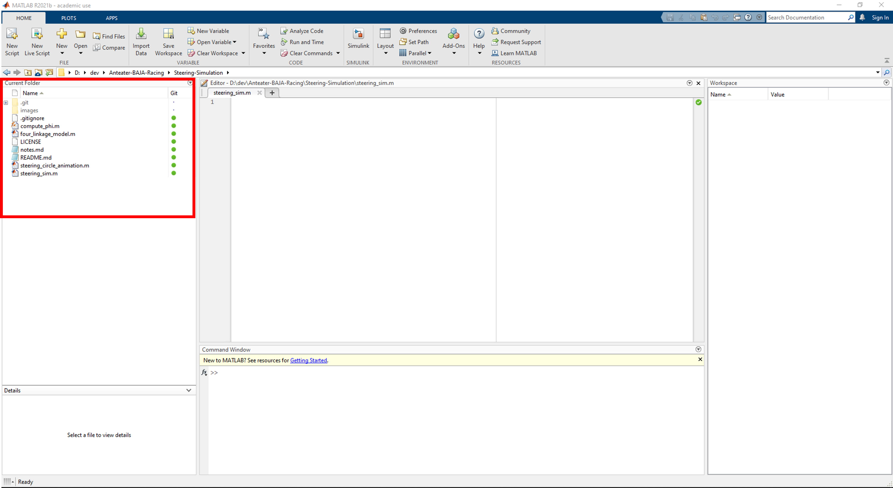

# Anteater-BAJA-Racing

## Table of Contents

- [Introduction](#Introduction)
- [Setting up Windows and Matlab for Git](#Setting-Up-our-Windows-Machine-to-Share-Code-with-MATLAB)
- [Using Git with MATLAB](#Using-Git-with-MATLAB)
- [Where and How to Write Notes](#Notes)

## Introduction

This repo contains the code for the Anteater BAJA Racing teams steering and suspension simulations.

If you look around you will wee two different steering simulations, one for a 4 bar linkage style steering and one for a 6 bar rack and pinion style steering. The 4 bar linkage is designed to confirm results that we have from the Vandal I while the 6 bar linkage is meant to test values before we make the Vandal II.

## Setting Up Your Windows Machine to Share Code with MATLAB

#### Installing Cygwin for MATLAB
1. Download the [cygwin](https://www.cygwin.com/) installer and then run it

2. Open librarypath.txt. In the MATLAB Command Window, enter:
```
edit(fullfile(matlabroot,"toolbox","local","librarypath.txt"))
```
Add the Cygwin bin folder location to the end of librarypath.txt, for example, ```C:\cygwin64\bin.```
If you do not have permission to edit the path, close MATLAB and reopen it in administrative mode.

3. Restart MATLAB

#### Installing Git for MATLAB
1. Download the [git](https://git-scm.com/downloads) installer and then run it

2. Open MATLAB

3. Navigate to ```Preferences->General->Source Control```
 and make sure "Enable MathWorks source control integration" is selected

 4. Open the cmd and enter ```ssh-keygen```

 5. On your computers file explorer navigate to ```C:\Users\"your username"\.ssh"``` and open the "id_rsa.pub" file in a text application (like notepad)

 6. Copy the text inside we will need it for the following steps


#### Using Github
1. Open your browser of choice

2. Navigate to [Github](https://github.com/signup?ref_cta=Sign+up&ref_loc=header+logged+out&ref_page=%2F&source=header-home) and create an account

3. Click on the top right of the github page where your profile picture is

3. Navigate to ```Settings->SSH and GPG keys``` and select "New SSH key"

4. Enter a name for the key then paste the text we got from the "id_rsa.pub" file

5. Send your username to the repo owner


## Using Git with MATLAB

#### Using Git on MATLAB
1. Open the project you copied from Github in MATLAB, it should look like this on the left side of your screen

2. Right click on any of the files
3. Navigate to ```Source Control```
4. Here you can view your options


#### Git Options
The three main options you will be using are ```View and Commit```, ```Push```, and ```Pull```

1. ```View and Commit``` saves the code that you have written so far and allows you to leave a commit message. The format for a commit message is ```prefix: Describe what you did```. Below you can see the possible commit prefixes.
    - At this point your code is still only on your computer, no one else can view what you've changed so far.
2. ```Push``` sends all your commited code to Github where other people can view it and download it
3. ```Pull``` grabs all the code from Github and copies it to your computer

#### Standard Git Commit Prefixes
These are standard prefixes that you use at the beginning of a git commit message that helps to show others what you've done. These will help us understand when certain changes were made at a glance.

- feat: The new feature you're adding
- fix: A bug fix
- style: Feature and updates related to styling
- refactor: Refactoring a specific section of the codebase
- test: Everything related to testing
- docs: Everything related to documentation
- chore: Regular code maintenance

## Notes
Use the ```notes.md``` file to record what you've done outside of commit messages. It helps build continuity between what's been done, what needs to be done, and by who.

The format is shown below, you can copy paste it and fill in your name, date, etc.

#### Part of Project Worked on
##### Name
##### Date (DDMMYYYY format)
Description of what was done
